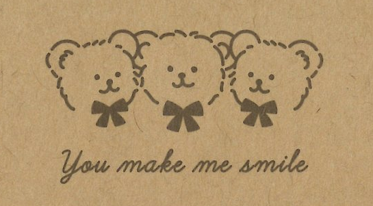

# Nini Bear🐻
Bienvenid@ a **Nini Bear** 🤎, un juego en el que debes ayudar a un osito llamado Nini a saltar y recoger su comida 🍗 mientras evitas los maletines 💼⚠️. ¡Si chocas con un maletín, perderás y tendrás que empezar de nuevo! 💥

---
. 
## 🌟 ¿Qué tienes que hacer?

- 🏆 Recoger la mayor cantidad de comida posible.
- ⚡ Esquivar los maletines para no perder.
- 💆 Relajarte  con la música de fondo
  
---

## 🤓 Tecnologías utilizadas
 
 

 

---

## ¡Estás invitado a probar Nini Bear🐻 en tu propio ordenador!

1. 😊 Clona el repositorio:  
   ```bash
   git clone [https://github.com/sarayminar/juego-poo.git]
2. 📂 Entra en la carpeta del proyecto:  
   ```bash
   cd juego-poo
   ```
3. ❤️ Abre el archivo `index.html` 

---
. 
